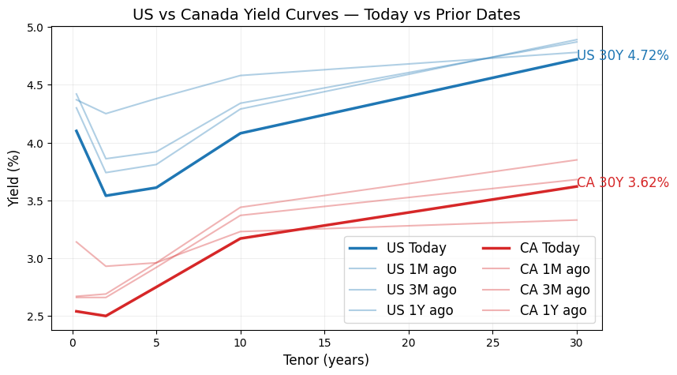
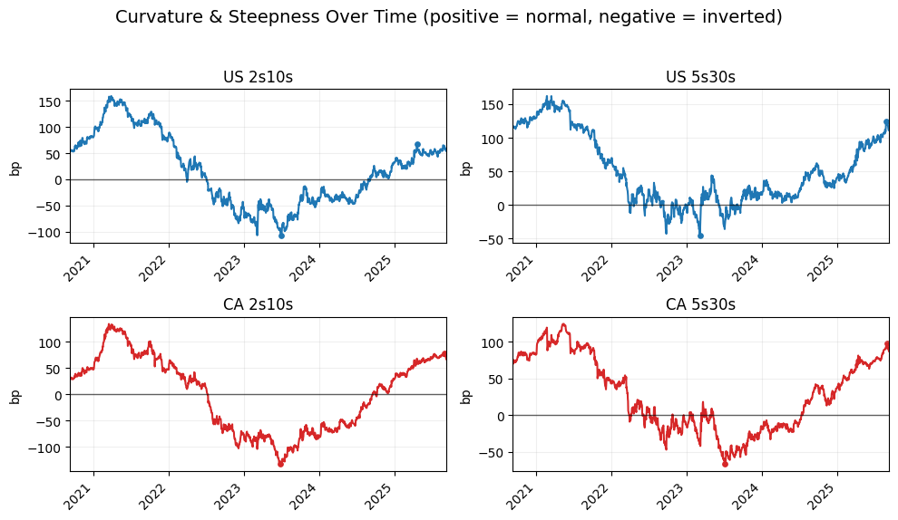
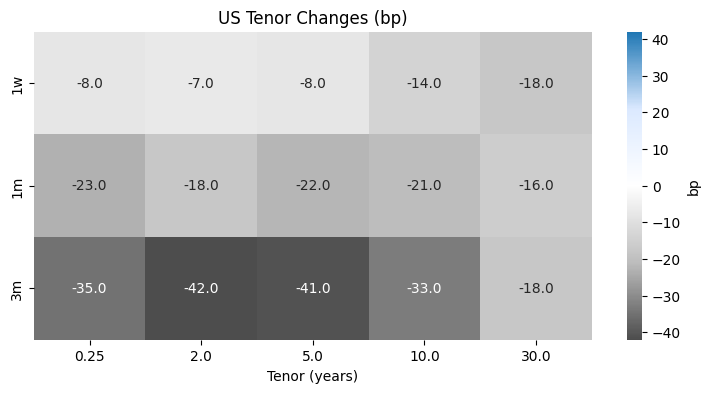
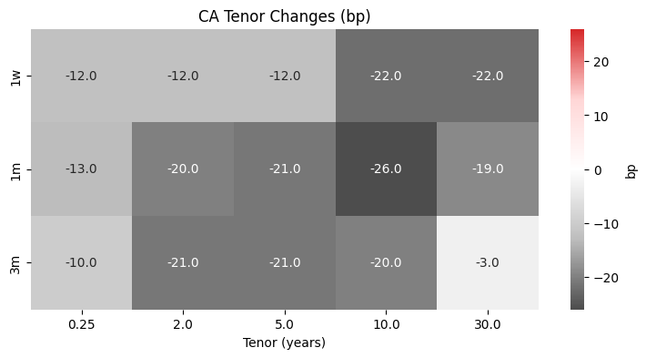
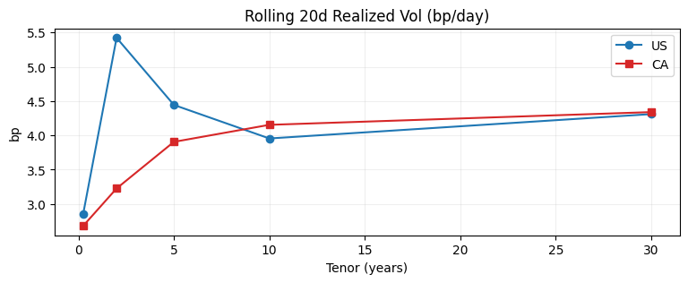
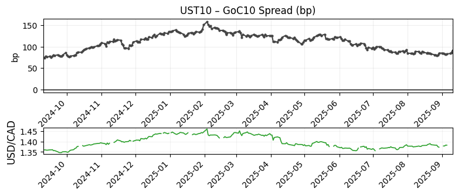
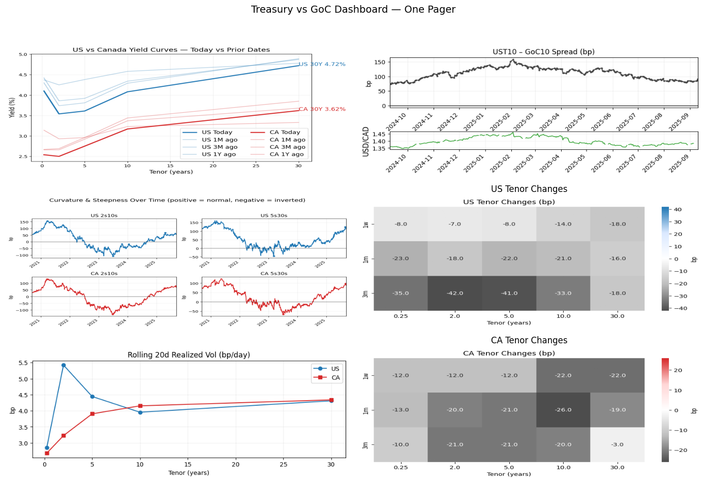

# Yield Curve History Dashboard (U.S. + Canada)

<!-- CI status badge: replace CSCoder33/Yield_Curve_History_Dashboard_U.S._Canada with your GitHub path after pushing -->
[](https://github.com/CSCoder33/Yield_Curve_History_Dashboard_U.S._Canada/actions/workflows/pipeline.yml)


This project builds a visual-first dashboard to compare U.S. Treasuries vs Government of Canada (GoC) curves over time, track slopes (2s10s, 5s30s), view historical curve shifts, and add volatility context. It ships both static outputs (PNG/SVG) and a live Streamlit app.

## What It Shows
- Curve snapshots: Today’s US and CA curves, plus 1m/3m/1y overlays
- Slope trackers: US/CA 2s10s and 5s30s small-multiples
- Tenor change heatmaps: 1d/1w/1m/3m Δbp
- Volatility strips: rolling 20d stdev of daily changes (bp)
- Cross-country: UST10 − GoC10 spread (bp) with ±1σ band
- One-pager: composed grid for quick sharing

## Data Sources
- FRED: DGS3MO, DGS2, DGS5, DGS10, DGS30
- Bank of Canada Valet API: GoC benchmark yields (configurable series IDs)
- Optional FX (USD/CAD): Yahoo, configurable

See `config/series.yaml` to change series IDs without code changes.

## Run Locally
1) Environment
- Python 3.10+
- Create venv and install requirements:

```
python3 -m venv .venv
source .venv/bin/activate
pip install -r requirements.txt
```

2) Offline demo (uses included sample processed dataset)
```
python scripts/run_pipeline.py  # will render using existing processed data
```
Artifacts write to `reports/figures/` and `reports/one_pagers/`.

3) Online pipeline (fetch, process, render)
```
# Optional: export OFFLINE=0 (default)
python scripts/run_pipeline.py
```
Note: Network fetch requires internet access; BoC IDs may need verification.

4) Run the app
```
streamlit run src/app.py
```
The app reads `data/processed/daily.parquet` or `daily.csv` and shows tabs for Curves | Slopes | Tenor Changes | Vol | Cross-Country | One-Pager.

## Configs
- `config/series.yaml`: series metadata (country, tenor, source, id)
- `config/viz.yaml`: lookbacks, colors, sizes, export
- `config/countries.yaml`: order, symbols, default tenors

## Validation & Tests
- Tenor join and slope correctness checks in `tests/`
- Artifact creation tests verify expected files exist and are non-empty

## Glossary
- Tenor: time to maturity
- Slope 2s10s/5s30s: difference between 10y−2y / 30y−5y yields
- bp vs %: 1% = 100 bp

Last updated: 2025-10-15

## Gallery (Auto‑Updated)

Below snapshots point to the “_latest” images the pipeline overwrites on each run.

<table>
  <tr>
    <td><strong>Curve Snapshot</strong><br></td>
    <td><strong>Slopes</strong><br></td>
  </tr>
  <tr>
    <td><strong>US Tenor Changes</strong><br></td>
    <td><strong>CA Tenor Changes</strong><br></td>
  </tr>
  <tr>
    <td><strong>Vol Strip</strong><br></td>
    <td><strong>UST10 – GoC10 + USD/CAD</strong><br></td>
  </tr>
  <tr>
    <td colspan="2" align="center"><em>Note: 1w/1m/3m = 5/21/63 trading days</em></td>
  </tr>
</table>

### One‑Pager (Shareable)


